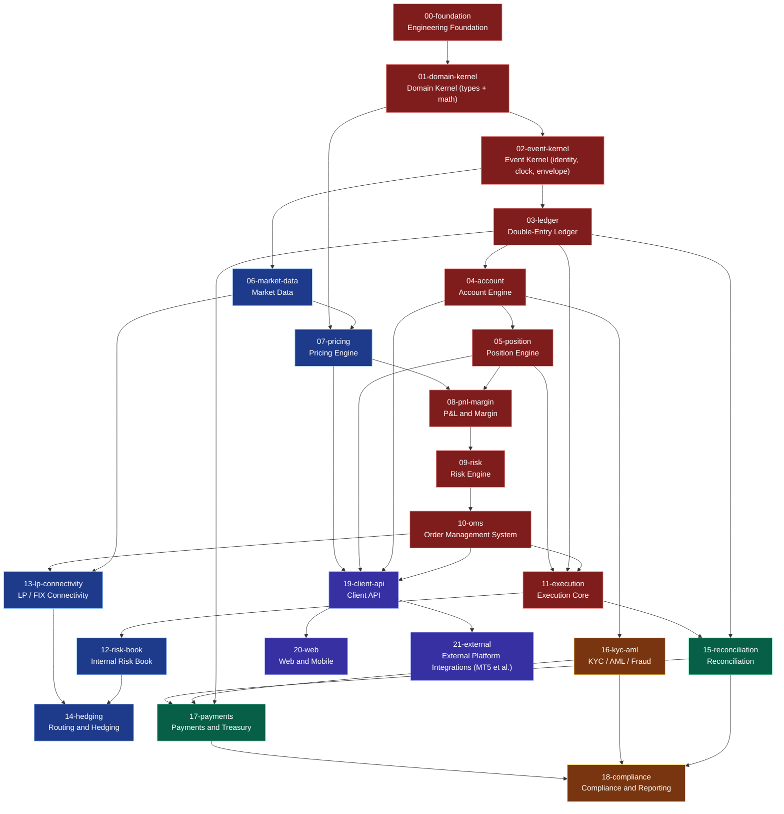

# 03 — Dependency DAG

The build order is not a preference. It is a graph, and it is enforced.

## The rule

> A module may not be built, merged or deployed while any module it depends on,
> transitively, is short of that dependency's declared gates.

Checked by [`scripts/check_gates.py`](../scripts/check_gates.py) on every PR:

```bash
$ python3 scripts/check_gates.py 11-execution
BLOCKED  11-execution
         upstream: 01-domain-kernel has not passed G0, G1, G2, G3, G4
         upstream: 03-ledger has not passed G0, G1, G2, G3, G4, G5, G6, G7, G8
         …
```

`scripts/check_dag.py` separately proves the graph is acyclic, that every declared
gate and tier exists, that no module omits a non-waivable gate, that a module
declaring invariants also requires `G4`, and that a module declaring an SLO also
requires `G9`.

## Why a DAG and not a checklist

A checklist lets you build the trading screen first because it demos well. A DAG
does not. The ordering here follows from what each thing *needs in order to be
correct*, not from what is most visible:

- Pricing needs a validated market state, or it prices from noise.
- P&L needs positions and prices, or it is fiction.
- Risk needs P&L and margin, or it is guessing.
- Execution needs risk, position and ledger, or it moves money it should not.
- Everything financial needs the ledger, and the ledger needs the event kernel,
  and the event kernel needs the domain kernel.

The graph is what makes those statements enforceable instead of merely true.

## The graph

<!-- BEGIN:DAG -->


### Build order

1. `00-foundation` — Engineering Foundation
2. `01-domain-kernel` — Domain Kernel (types + math)
3. `02-event-kernel` — Event Kernel (identity, clock, envelope)
4. `03-ledger` — Double-Entry Ledger
5. `04-account` — Account Engine
6. `05-position` — Position Engine
7. `06-market-data` — Market Data
8. `07-pricing` — Pricing Engine
9. `08-pnl-margin` — P&L and Margin
10. `09-risk` — Risk Engine
11. `10-oms` — Order Management System
12. `11-execution` — Execution Core
13. `12-risk-book` — Internal Risk Book
14. `13-lp-connectivity` — LP / FIX Connectivity
15. `14-hedging` — Routing and Hedging
16. `15-reconciliation` — Reconciliation
17. `16-kyc-aml` — KYC / AML / Fraud
18. `17-payments` — Payments and Treasury
19. `18-compliance` — Compliance and Reporting
20. `19-client-api` — Client API
21. `20-web` — Web and Mobile
22. `21-external` — External Platform Integrations (MT5 et al.)
<!-- END:DAG -->

## Parallelism

The graph is not a single chain. Once the shared roots are green, independent
branches proceed simultaneously:

- **Market data** (`06`) depends only on the event kernel. It can be built in
  parallel with the entire account/position branch.
- **KYC/AML** (`16`) depends only on accounts. It does not wait for trading.
- **Reconciliation** (`15`) starts as soon as the ledger and execution exist —
  deliberately early, because it is how the core proves itself.
- **LP connectivity** (`13`) can be developed against a simulated LP long before
  a real LP contract is signed.

What cannot be parallelised is the spine: `01 → 02 → 03 → 04 → 05 → 08 → 09 → 10 → 11`.
Every attempt to shortcut it produces a system whose financial behaviour cannot
be proven.

## Tiers and blast radius

| Tier | Name | If it is wrong | Change policy |
|---|---|---|---|
| **T0** | Financial Core | Money is wrong | Manual approval, two reviewers, replay + reconciliation clean |
| **T1** | Market Infrastructure | Prices or liquidity are wrong | Manual approval, performance gate mandatory |
| **T2** | Financial Operations | Settlement is wrong | Manual approval, reconciliation clean |
| **T3** | Compliance | Regulatory breach | Compliance owner approval |
| **T4** | Experience | Clients are inconvenienced | Automated canary, auto-promote |

Tier determines gate strictness, approval requirements and deployment isolation.
See [07 — Deployment topology](07-deployment-topology.md).

## Changing the graph

Add or modify the module in [`registry/modules.yaml`](../registry/modules.yaml),
run `python3 scripts/check_dag.py`, then `make docs`. Submit the registry change
as its own PR so the graph is reviewed before any code exists to bias the
discussion.
